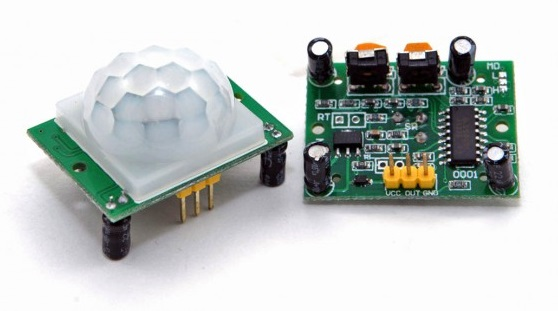
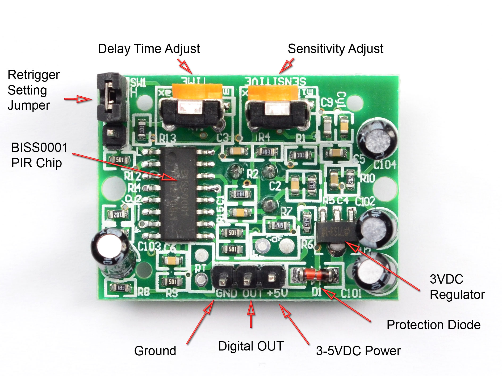
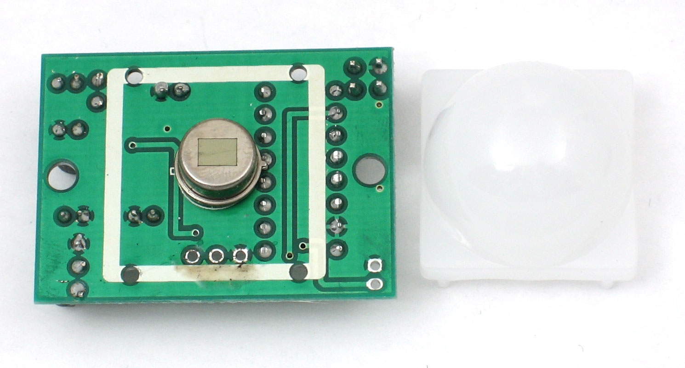

# Motion-controlled-Lamp-Without-a-Microcontroller-
This motion-controlled light bulb project uses PIR Motion sensor along with a relay and a transistor under just INR 150/-.
### Hardware components:
1. PIR Motion Sensor (generic)	
2. General Purpose Transistor NPN
3. Resistor 1k ohm
4. Relay 5V
5. LED Light Bulb
6. Wires
7. 1N4007 – High Voltage, High Current Rated Diode
### Background
A PIR (Passive Infra-Red) Motion sensor triggers its output pin HIGH when it detects IR radiation from any living body. PIRs are basically made of a pyroelectric sensor (which you can see below as the round metal can with a rectangular crystal in the centre), which can detect levels of infrared radiation. Everything emits some low-level radiation, and the hotter something is, the more radiation is emitted. The sensor in a motion detector is actually split into two halves. The reason for that is that we are looking to detect motion (change), not average IR levels. The two halves are wired up so that they cancel each other out. If one half sees more or less IR radiation than the other, the output will swing high or low.
<!-- 

 -->

The overview of the sensor is as follows:
In this project, I have used a transistor BC547 which acts as a switch to trigger the Relay when the output of the PIR Motion Sensor goes high. The time delay and sensitivity can be adjusted using the potentiometers present onboard the sensor. Depending on the threshold of the relay, an appropriate load can be selected.

*Credits: How to make a motion sensor light at home with explanation | PIR sensor | Transistor-BC547| DIY - YouTube*

### Schematic Circuit Diagram
<!-- .jpg) -->
.jpg)